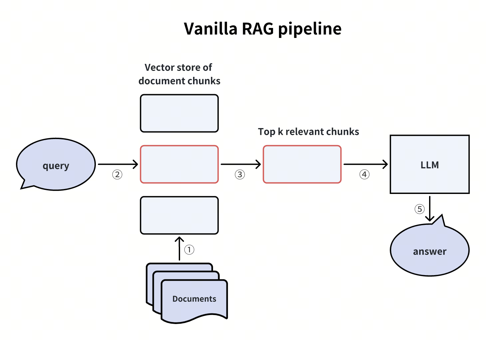
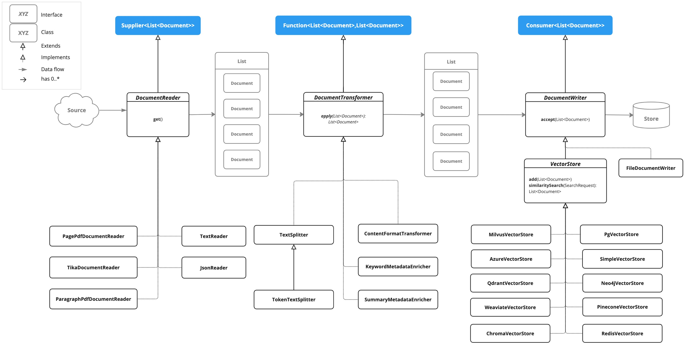

# SpringBoot-AI Build RAG

Retrieval Augmented Generation (RAG) is a technique useful to overcome the limitations of large language models that struggle with long-form content, factual accuracy, and context-awareness.




## Information

Spring AI provides out-of-the-box support for common RAG flows using the Advisor API.

`QuestionAnswerAdvisor` A vector database stores data that the AI model is unaware of. When a user question is sent to the AI model, a QuestionAnswerAdvisor queries the vector database for documents related to the user question.

The response from the vector database is appended to the user text to provide context for the AI model to generate a response.

Assuming you have already loaded data into a VectorStore, you can perform Retrieval Augmented Generation (RAG) by providing an instance of QuestionAnswerAdvisor to the ChatClient.

```
ChatResponse response = ChatClient.builder(chatModel)
.build().prompt()
.advisors(new QuestionAnswerAdvisor(vectorStore))
.user(userText)
.call()
.chatResponse();
```
In this example, the QuestionAnswerAdvisor will perform a similarity search over all documents in the Vector Database. To restrict the types of documents that are searched, the SearchRequest takes an SQL like filter expression that is portable across all VectorStores.

This filter expression can be configured when creating the QuestionAnswerAdvisor and hence will always apply to all ChatClient requests or it can be provided at runtime per request.

Here is how to create an instance of QuestionAnswerAdvisor where the threshold is 0.8 and to return the top 6 reulsts.

```
var qaAdvisor = new QuestionAnswerAdvisor(this.vectorStore,
SearchRequest.builder().similarityThreshold(0.8d).topK(6).build());
```
Dynamic Filter Expressions
Update the SearchRequest filter expression at runtime using the FILTER_EXPRESSION advisor context parameter:

```
ChatClient chatClient = ChatClient.builder(chatModel)
.defaultAdvisors(new QuestionAnswerAdvisor(vectorStore, SearchRequest.builder().build()))
.build();

// Update filter expression at runtime
String content = this.chatClient.prompt()
.user("Please answer my question XYZ")
.advisors(a -> a.param(QuestionAnswerAdvisor.FILTER_EXPRESSION, "type == 'Spring'"))
.call()
.content();
```
The FILTER_EXPRESSION parameter allows you to dynamically filter the search results based on the provided expression.

## Requirements
- JDK17+
- SpringBoot 3.3+
- [Ollama](https://ollama.com/)
- [milvus](https://milvus.io/zh)

## Springboot VectorStore & ETL

VectorStore is a Spring Boot application that provides a service for storing and retrieving vectors. It uses the VectorDB library to store and retrieve vectors.

Document is SpringBoot-AI ETL data model, which is used to store the data of the document. docx, pdf, txt, json types file can be converted to Document object.



Document fields are as follows:
1. id: Document id
2. text: Document content
3. media: Document media type
4. metadata: Document metadata,that is a map of key-value pairs
5. score: Document score, which is used to simulate the relevance of the document, score default is null, only used in the retrieval process
6. contentFormatter: Document content formatter, Mutable, ephemeral, content to text formatter. Defaults to Document text.

MilvusVectorStore(VectorStore implementation) fields are as follows:
1. doc_id: id of the document 
2. content: content of the document
3. metadata: metadata of the document
4. embedding: document text field embedding data
5. score: score of the document,Mutable, ephemeral, content to text formatter. Defaults to Document text.


## References
- [SpringBoot-RAG](https://docs.spring.io/spring-ai/reference/api/retrieval-augmented-generation.html)
- [SpringBoot-ETL](https://docs.spring.io/spring-ai/reference/api/etl-pipeline.html)
- [vector db](https://docs.spring.io/spring-ai/reference/api/vectordbs.html)
- [milvus](https://milvus.io)

## FQA
1. springboot-ai not support rerank search result, so we need to implement it by ourselves.

